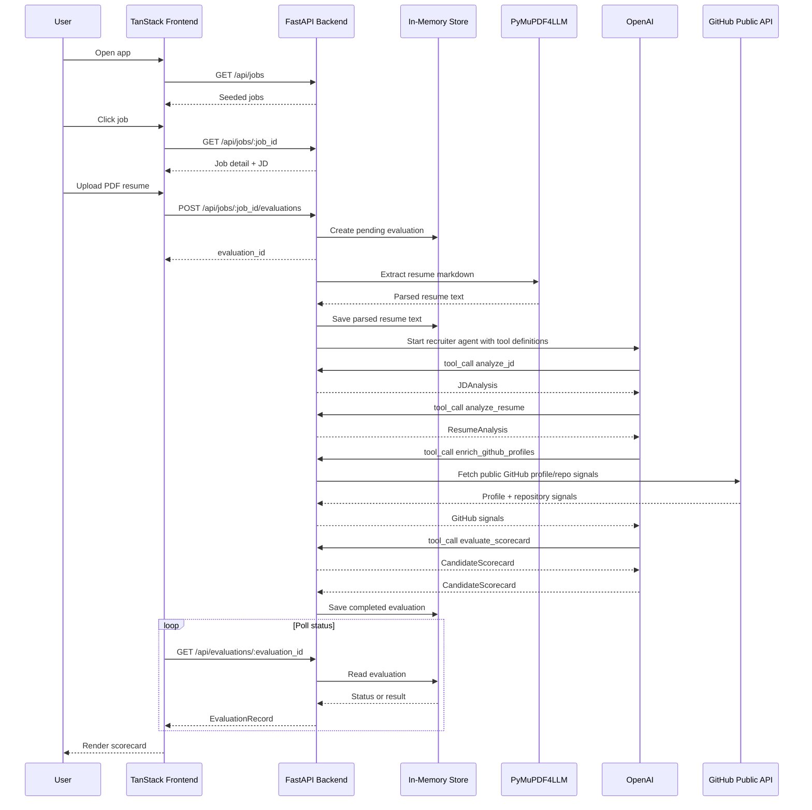

# Fleet Recruiter AI Agent

AI recruiter app for evaluating a PDF resume against a backend-owned job description.

Python lives at the repository root and is managed with `uv`. The TanStack Start frontend lives in `ui/`.

## Environment

Create a root `.env` file:

```env
OPENAI_API_KEY=your_key
```

## Backend

```sh
uv run uvicorn fleet_recruiter_ai_agent.api.app:app --reload
```

The backend exposes job catalog and evaluation endpoints under `/api`. Jobs are seeded in Python; users do not submit JDs. The recruiter runs as an OpenAI tool-calling agent after PDF parsing.

## Frontend

```sh
cd ui
npm run dev
```

The frontend shows jobs, lets a user upload a PDF resume, polls evaluation status, and renders the scorecard. In dev, `/api` is proxied to the FastAPI backend on port `8000`.
By default the UI calls `http://127.0.0.1:8000`; override with `VITE_API_BASE_URL` if needed.

## Flow


