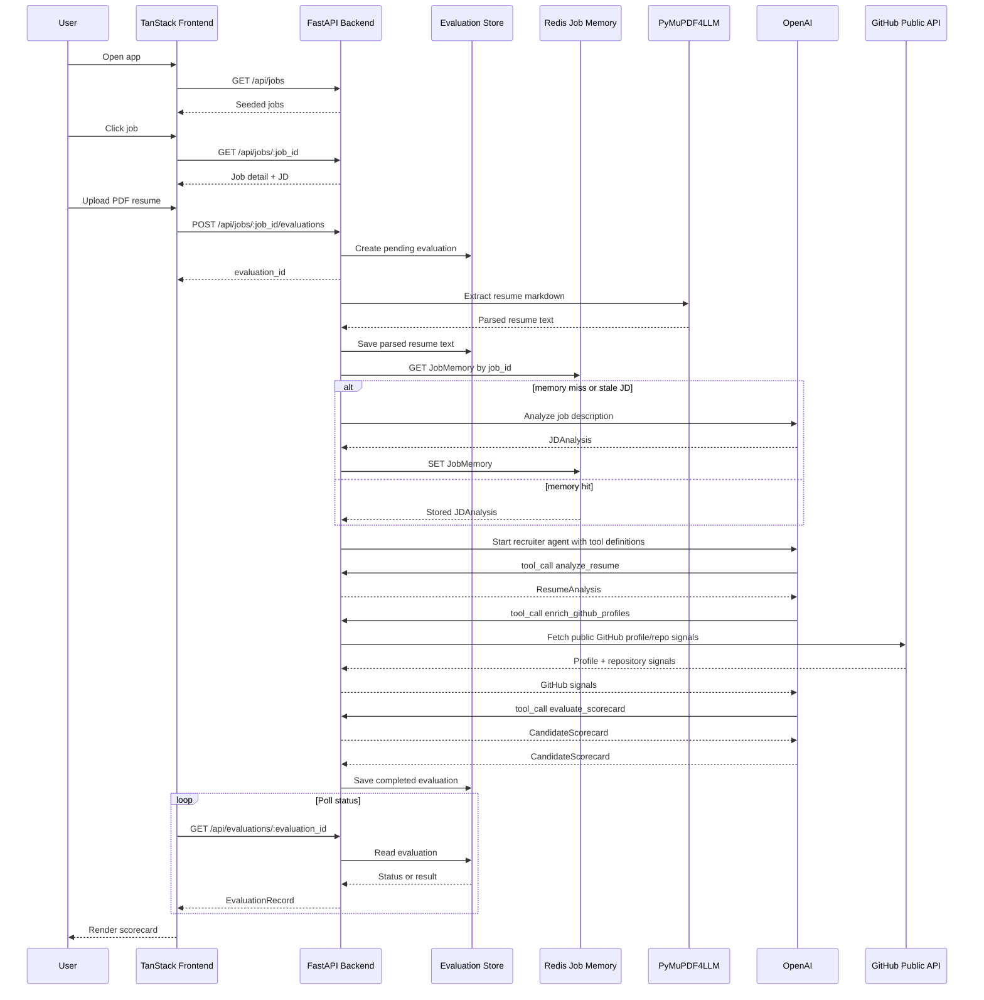

# Fleet Recruiter AI Agent

AI recruiter app for evaluating a PDF resume against a backend-owned job description.

Python lives at the repository root and is managed with `uv`. The TanStack Start frontend lives in `ui/`.

## Environment

Create a root `.env` file:

```env
OPENAI_API_KEY=your_key
REDIS_URL=redis://localhost:6379/0
MEMORY_NAMESPACE=fleet-recruiter
```

Start Redis locally:

```sh
docker run --name fleet-recruiter-redis -p 6379:6379 -d redis:7
```

Redis stores one analyzed memory record per job ID: the title, original job description,
and structured `JDAnalysis`. Candidate resumes and scorecards are not retained.

## Backend

```sh
uv sync
uv run uvicorn fleet_recruiter_ai_agent.api.app:app --reload
```

The backend exposes job and evaluation endpoints under `/api`. Three jobs are seeded
for the demo, and additional jobs can be created or replaced through the API.

Creating a job analyzes and stores its JD before the endpoint succeeds:

```sh
curl -X POST http://127.0.0.1:8000/api/jobs \
  -H 'Content-Type: application/json' \
  -d '{
    "title": "Platform Engineer",
    "company": "FleetWorks",
    "location": "Remote",
    "summary": "Build reliable internal platforms.",
    "job_description": "Must have Python, Kubernetes, and CI/CD experience."
  }'
```

Replace a job with `PUT /api/jobs/{job_id}` using the same JSON fields. A changed title
or description is re-analyzed before the update becomes available to candidates.

## Job memory lifecycle

```text
job created or updated
  -> analyze JD with OpenAI
  -> store JobMemory in Redis by job_id

candidate applies to job_id
  -> look up JobMemory before exposing agent tools
  -> cache hit: reuse stored JDAnalysis
  -> cache miss or stale title/description: analyze and store JDAnalysis
  -> analyze candidate resume
  -> optionally enrich GitHub evidence
  -> generate candidate scorecard
```

The seeded demo jobs are indexed lazily on their first evaluation. Jobs created through
the API are indexed immediately.

Semantic chunking is intentionally dormant while applications target a known `job_id`.
The retained implementation is reserved for a future job-discovery flow where a
candidate uploads a resume without selecting a job and the platform searches all jobs.

## Frontend

```sh
cd ui
npm run dev
```

The frontend shows jobs, lets a user upload a PDF resume, polls evaluation status, and renders the scorecard. In dev, `/api` is proxied to the FastAPI backend on port `8000`.
By default the UI calls `http://127.0.0.1:8000`; override with `VITE_API_BASE_URL` if needed.

## Flow



## API

| Method | Path | Purpose |
|---|---|---|
| `GET` | `/api/jobs` | List jobs. |
| `POST` | `/api/jobs` | Create, analyze, and index a job. |
| `GET` | `/api/jobs/{job_id}` | Read one complete job. |
| `PUT` | `/api/jobs/{job_id}` | Replace a job and refresh stale memory. |
| `POST` | `/api/jobs/{job_id}/evaluations` | Upload a candidate PDF for a job. |
| `GET` | `/api/evaluations/{evaluation_id}` | Poll evaluation status and result. |
